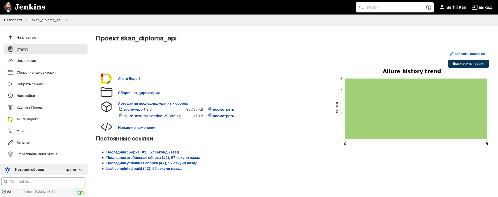
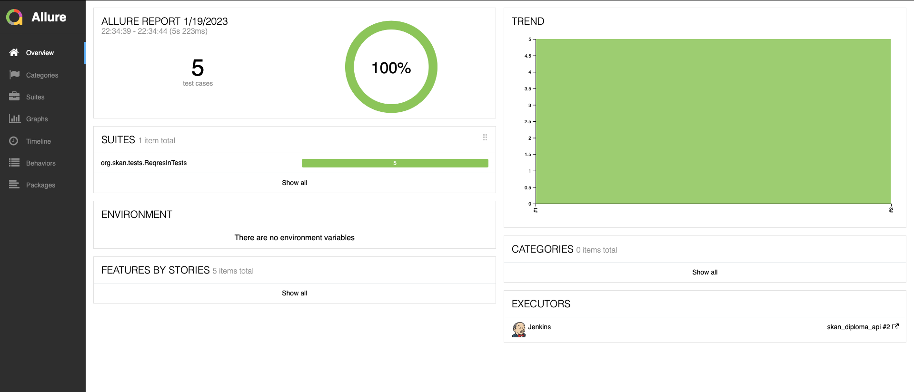
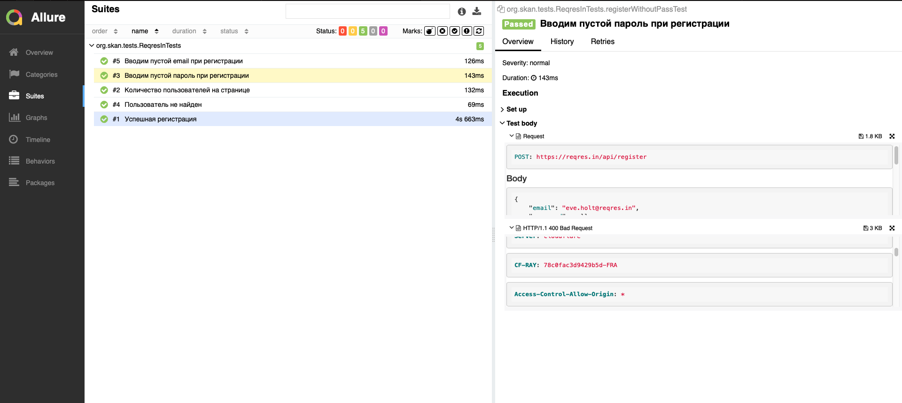
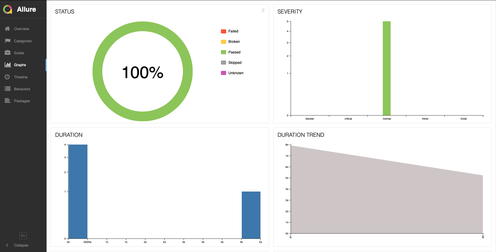
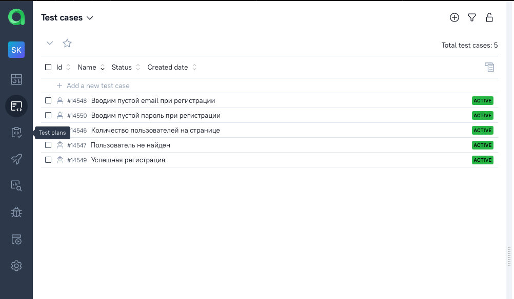
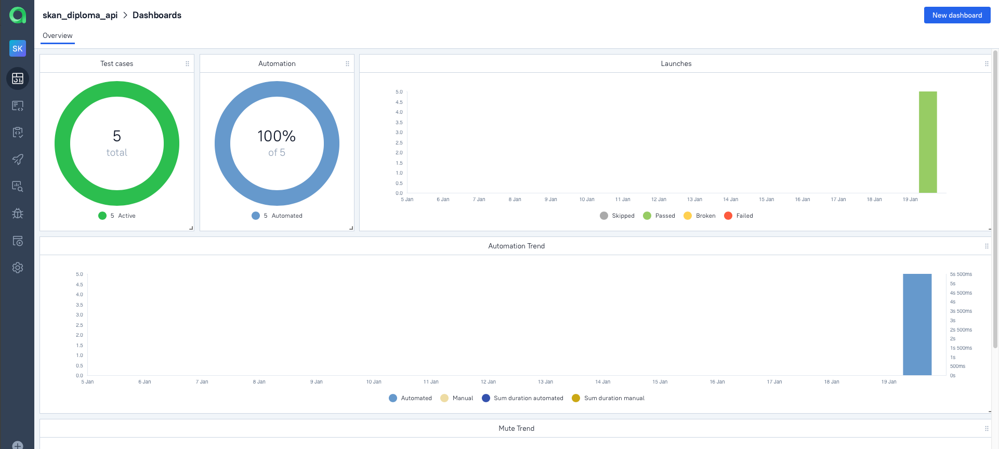
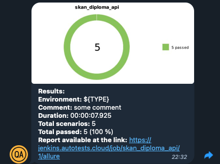

# Дипломный проект по API тестированию для [reqres.in](https://reqres.in/)

## Содержание:

* [Технологии, используемые в данном проекте](#technologist-технологии-в-данном-проекте)
* [Тест кейсы](#bookmark_tabs-реализованные-проверки)
* [Сборка в Jenkins](#-запуск-тестов-в-jenkins)
* [Информация о тестах в Allure report](#-отчет-о-результатах-тестирования-в-Allure-report)
* [Интеграция с AllureTestOps](#-интеграция-с-allure-testops)
* [Уведомления в Telegram с использованием бота](#-уведомления-в-telegram-с-использованием-бота)

## Технологии, используемые в данном проекте

## Тест кейсы

✓ Успешная регистрация

✓ Количество пользователей на странице

✓ Вводим пустой папроль при регистрации

✓ Пользователь не найден

✓ Вводим пустой email при регистрации

## [Сборка в Jenkins](https://jenkins.autotests.cloud/job/skan_diploma_api/)

Для запуска сборки необходимо нажать на кнопку <code><strong>*Собрать*</strong></code>.

  

## Информация о тестах в [Allure report](https://jenkins.autotests.cloud/job/skan_diploma_api/3/allure)

### Главное окно

  

### Окно с тестовыми кейсами

  

### Окно с графиками

  

## Интеграция с [AllureTestOps](https://allure.autotests.cloud/jobrun/17746)

###Тест-кейсы

  

###Дашборд

  

## Уведомление в Telegram

После завершения тестов отчет о прохождении приходит в Telegram с помощью заранее созданного бота

  

